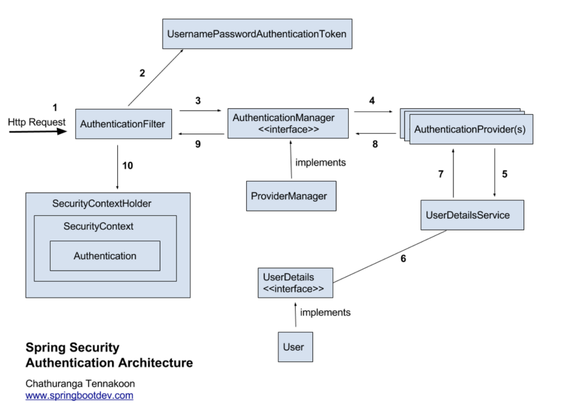

# Spring Security

### 인증

- 자격 증명을 확인하는 절차이다.
- 쉽게말해서 유저가 누구인지 신원을 증명하는 것

### 인가

- 엑세스 권한을 확인하는 프로세스
- 인증을 마친 유저에게 권한을 부여하여 특정 리소스에 접근할 수 있게 허가해주는 과정
- Spring Security에서 권한은 ROLE 형태로 부여된다.

1. Http Request로 id(username) 과 password를 가진 상태로 접근한다.
2. `AuthenticationFilter`는 사용자로부터 받은 id와 password를 이용하여 `UsernamePasswordAuthenticationToken`을 만든다.
3. 그 Token을 `AuthenticationManager`로 보내주면 `AuthenticationManager`는 Token에 저장된 username을 4,5,6번 과정을 거쳐 DB에 존재유무를 확인한다.
4. 해당 username이 있다면 `AuthenticationManager`는 password를 DB에 저장된 형태와 같은 해쉬 함수를 사용하여 암호화 시킨 후 DB에 저장된 password와 비교한다.
5. 모든 비교가 성공하면, `AuthenticationManager`는 `Authentication`이라는 객체를 생성하여 `SecurityContextHolder` 에 `SecurityContext`에 저장한다.