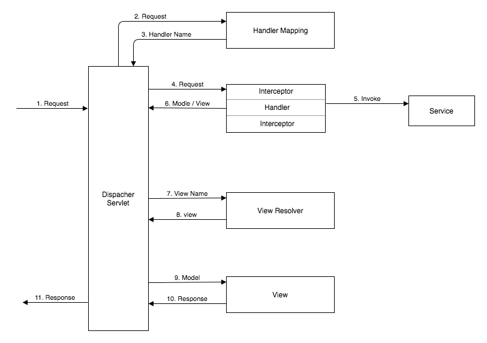

# Spring MVC

- MVC는 애플리케이션을 구성하는 요소를 역할에 따라 세 가지 모듈로 나누어 구분한 패턴이다.

### 1. MVC1

- view 와 Controller를 모두 JSP가 담당하는 형태를 가진다.
- JSP 하나에서 View와 Controller의 역할을 모두 담당하다보니 가독성도 떨어지고 유지보수에 문제가 발생한다.

### 2. MVC2

- MVC1 에서 유지보수가 힘들다는 단점을 보완하기 위해 나온 모델
- JSP는 뷰의 역할만 하고 Controller의 역할을 서블릿이 수행한다.
- 사용자의 요청을 컨트롤러가 먼저 받고 알맞게 처리한다.

### Spring MVC

- MVC2 모델을 발전시켜 나온 웹 기반 모듈
- DispatcherServlet이 HTTP 프로토콜로 들어오는 모든 요청을 가장 먼저 받아 적합한 컨트롤러에 위임해주는 프론트 컨트롤러(Front Controller)역할을 한다.

### Request를 처리하는 과정

1. 브라우저는 특정 URL에 요청을 보낸다. DispatcherSevlet은 모든 요청을 처리하는 프론트 컨트롤러이다. 그래서 DispacherSevlet이 요청을 받는다.
2. DispacherSevlet URI를 보고, 이를 처리하기 위해 올바른 컨트롤러를 식별 해야한다. 올바른 컨트롤러를 찾는 데 도움을 주기위해 핸들러 매핑과 통신한다.
3. 핸들러 매핑은 요청을 처리하는 특정 핸들러 메서드(BasicModelViewController)를 반환한다.
4. DispacherSevlet은 특정 핸들러 메서드를 호출한다.
5. 핸들러 메서드는 모델 뷰를 반환한다. ModleAndView 객채나 혹은 @ResponseBody 어노테이션이 있으면 모델 뷰를 반환하지 않는다.(modleAndView를 null로 반환하고 서블릿 내부 코드의 HttpMessageConverter에 의해서 직렬화 작업이 진행된다.)
6. DispacherSevlet에는 논리적 뷰 이름이 있다. 따라서 물리적 뷰 이름을 결정하는 방법을 알아내야한다. 사용할 수있는 뷰 리졸버가 있는지 여부를 확인하고 설정된 뷰 리졸버를 찾는다.
7. 뷰 리졸버는 논리적 뷰 이름을 물리적 뷰 이름에 매핑하는 로직을 실행한다.
8. DispacherSevlet은은 뷰를 실행한다. 또한 뷰에서 모델을 사용할 수 있게한다.
9. 뷰는 DispacherSevlet으로 보내질 내용을 반환한다.
10. DispacherSevlet은 응답을 다시 브리우저로 보낸다.